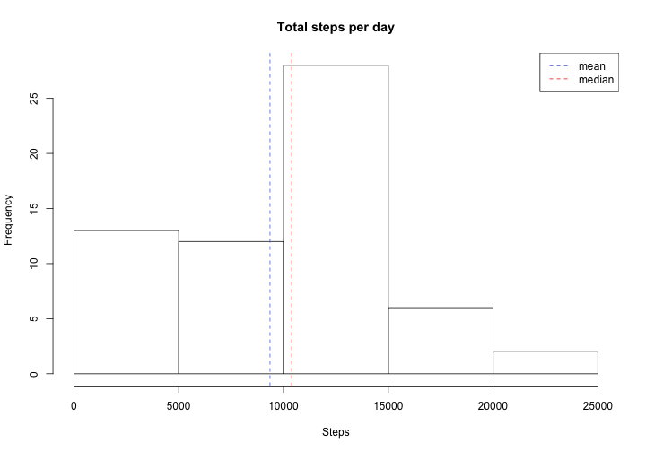
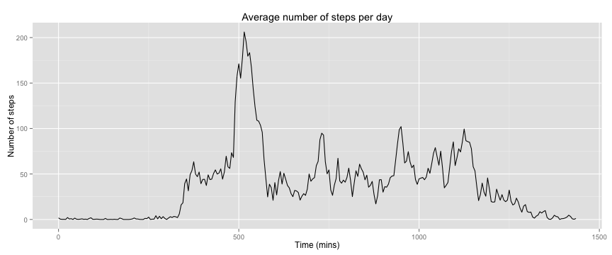
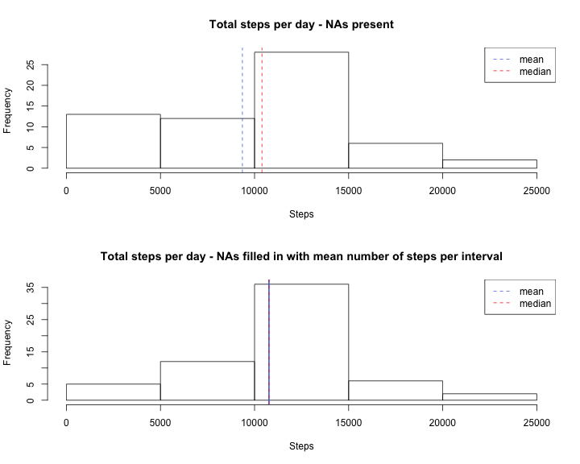
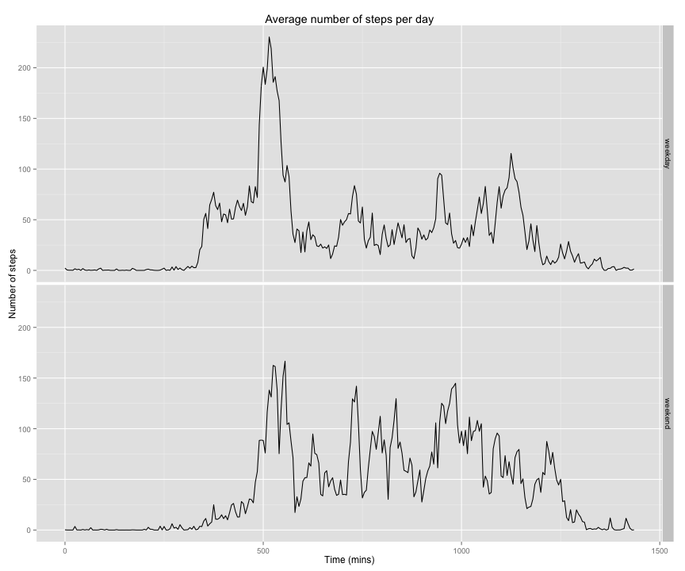

---
title: "Reproducible Research: Peer Assessment 1"
output: 
  html_document:
    keep_md: true
--- 


```r
# load necessary libs
if (!require(dplyr)) {
        install.packages("dplyr")
        require(dplyr)
}
if (!require(ggplot2)) {
        install.packages("ggplot2")
        require(ggplot2)
}
```
### Loading and preprocessing the data

```r
# read in the data set
activity <- read.csv("activity.csv", colClasses = c("numeric", "Date", "numeric"))
# add a column containing 'real' 5-min intervals i.e. 5 min offsets from 0, eg:
# 55 - 60 (0h 55mins - 1h 00mins) - vs. original (hh)mm notation that introduces 
# gaps between 55 mins past and next hour, eg: 55 - 100 (0h 55mins - 1h 00mins).
# All plots are drawn using this 'real' 5 min interval sequence as x axis.
activity <- mutate(activity, interval_mins = (interval %/% 100 * 60) + interval %% 100)
```

### What is mean total number of steps taken per day?

```r
# calculate total steps per day
totalStepsPerDay <- tapply(activity$steps, activity$date, sum, simplify=T, na.rm=T)
hist(totalStepsPerDay, main = "Total steps per day", xlab = "Steps")
abline(v = mean(totalStepsPerDay), col = "royalblue", lty = 2)
abline(v = median(totalStepsPerDay), col = "red", lty = 2)
legend(x = "topright", c("mean", "median"), 
       col = c("royalblue", "red"), lt = c(2, 2))
```

 

Mean total number of steps taken per day:

```r
mean(totalStepsPerDay)
```

```
## [1] 9354.23
```


Median total number of steps taken per day:

```r
median(totalStepsPerDay)
```

```
## [1] 10395
```

### What is the average daily activity pattern?

```r
steps_df <- activity %>%
        group_by(interval, interval_mins) %>%
        # calculate average number of steps by interval and store in 
        # 'mean_steps' column
        summarize(mean_steps = mean(steps, na.rm = T))

ggplot(steps_df, aes(interval_mins, mean_steps)) + 
        geom_line() +
        labs(title = "Average number of steps per day") +
        labs(x = "Time (mins)", y = "Number of steps")
```

 

The 5-minute interval that contains the max number of steps (on the 'real' minute scale):


```r
with(steps_df, steps_df[mean_steps == max(mean_steps),][["interval_mins"]])
```

```
## [1] 515
```

or on the original '(hh)mm' scale: 


```r
with(steps_df, steps_df[mean_steps == max(mean_steps),][["interval"]])
```

```
## [1] 835
```

### Imputing missing values

The total number of missing values in the dataset:

```r
sum(is.na(activity$steps))
```

```
## [1] 2304
```

As a strategy for filling in all missing values, let's replace all NAs with a
mean number of steps value for that 5-min interval


```r
activity2 <- activity %>%
        group_by(interval_mins) %>%
        ## replace NAs with mean values for that 5-min interval
        mutate(steps = ifelse(is.na(steps), mean(steps, na.rm=T), steps))
totalStepsPerDay2 <- tapply(activity2$steps, activity$date, sum, simplify=T)

par(mfrow = c(2, 1))

hist(totalStepsPerDay, main = "Total steps per day - NAs present", xlab = "Steps")
abline(v = mean(totalStepsPerDay), col = "royalblue", lty = 2)
abline(v = median(totalStepsPerDay), col = "red", lty = 2)
legend(x = "topright", c("mean", "median"), col = c("royalblue", "red"),
        lt = c(2, 2))

hist(totalStepsPerDay2, main = "Total steps per day - NAs filled in with mean number of steps per interval", xlab = "Steps")
abline(v = mean(totalStepsPerDay2), col = "royalblue", lwd = 2)
abline(v = median(totalStepsPerDay2), col = "red", lty = 2)
legend(x = "topright", c("mean", "median"), col = c("royalblue", "red"),
       lty = c(2, 2))
```

 

Mean total number of steps taken per day:

```r
mean(totalStepsPerDay2)
```

```
## [1] 10766.19
```

Median total number of steps taken per day:

```r
median(totalStepsPerDay2)
```

```
## [1] 10766.19
```

Both mean and median total number of steps per day have slightly increased as a result of  imputing missing data on the estimates of the total daily number of steps:


```
## Mean total steps:  9354.23  ->  10766.19
```

```
## Median total steps:  10395  ->  10766.19
```

### Are there differences in activity patterns between weekdays and weekends?


```r
activity2 <- activity2 %>%
        # add a column with weekdays for each date value
        # and convert into 'weekend'-'weekday' factor
        mutate(day = as.factor(ifelse(weekdays(date, abbreviate=T) %in% 
                        c("Sat", "Sun"), "weekend", "weekday")))  %>%               
        group_by(day, interval_mins)

steps2_df <- summarise(activity2, mean_steps = mean(steps))

ggplot(steps2_df, aes(interval_mins, mean_steps)) + 
        geom_line() + facet_grid(day ~ .) + 
        labs(title = "Average number of steps per day") +
        labs(x = "Time (mins)", y = "Number of steps")
```

 
